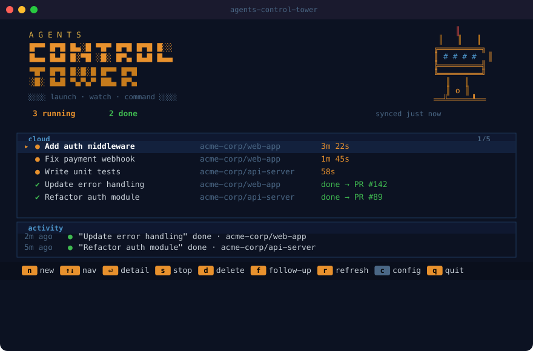
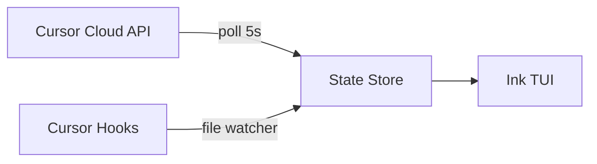

# agents-control-tower

Your Cursor agents are running. Do you know what they're doing?

[](https://github.com/ofershap/agents-control-tower/actions/workflows/ci.yml)
[](https://opensource.org/licenses/MIT)
[](https://www.typescriptlang.org/)

```bash
npx agents-control-tower
```

One command. The tower lights up.

<p align="center">
  
</p>

Running agents pulse amber. Done agents link to their PR. Errors glow red.

---

## What you can do

Launch agents, send follow-ups, stop runaways, delete old ones. All from one terminal.

| Key | Action |  |
|-----|--------|--|
| `n` | Launch a new cloud agent | Pick repo, write prompt, choose model |
| `f` | Send follow-up | Give a running agent new instructions |
| `s` | Stop an agent | Kill it mid-run |
| `d` | Delete an agent | Remove permanently |
| `o` | Open in browser | Jump to the PR or agent URL |
| `enter` | View details | Full conversation, metadata, status |
| `r` | Refresh | Force sync with Cursor API |

---

## Install

Run directly with npx (nothing to install):

```bash
npx agents-control-tower
```

Or install globally to get `agents-control-tower` and the short alias `act`:

```bash
npm install -g agents-control-tower
act
```

First run asks for your Cursor API key. Grab one from [cursor.com/dashboard - Integrations](https://cursor.com/dashboard?tab=integrations). Saved to `~/.agents-control-tower/config.json`.

Or pass it as an env var:

```bash
CURSOR_API_KEY=sk-... act
```

---

## How it works

| Source | What | How |
|--------|------|-----|
| Cursor Cloud API | List, launch, stop, delete agents. Read conversations | REST, polled every 5s |
| Cursor Hooks (coming) | Local IDE sessions, file edits, shell commands | File-based event stream |



Built with [Ink 5](https://github.com/vadimdemedes/ink), TypeScript strict, Node 20+.

---

## Screens

Launch wizard - pick repo (fuzzy filter), write the task, select model, go.

Agent detail - repo, branch, PR link, your prompt, and the full agent response with scroll.

Follow-up - send new instructions to a running agent without leaving the terminal.

Stop / Delete - inline confirmation. Press `s` or `d`, then `y`.

---

## Keyboard map

```
 DASHBOARD                          DETAIL VIEW
 ──────────────────────────         ──────────────────────────
 n         launch new agent         esc       back to dashboard
 ↑ / k     move up                  f         send follow-up
 ↓ / j     move down                s         stop agent
 enter     open detail              d         delete agent
 s         stop selected            o         open PR / URL
 d         delete selected          ↑↓        scroll message
 r         force refresh
 q         quit                    LAUNCH FLOW
                                    ──────────────────────────
 GLOBAL                             ↑↓        navigate options
 ──────────────────────────         /         filter repos
 ctrl+c    quit immediately         enter     select / confirm
 c         reconfigure              esc       cancel / go back
```

---

## Contributing

PRs welcome. See [CONTRIBUTING.md](CONTRIBUTING.md) for setup.

---

## Author

[](https://gitshow.dev/ofershap)

[](https://linkedin.com/in/ofershap)
[](https://github.com/ofershap)

## License

[MIT](LICENSE) © [Ofer Shapira](https://github.com/ofershap)
